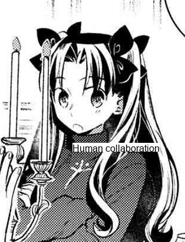

# 🅱️ boblov
the true legend of old

TOHacks entry along with [our backend api](https://github.com/0x534b/manga-translation-api) that does all the translation and typesetting

# ⬇️ how to install
clone repo   requirements   do the thing 

# 👑 hall of fame
somewhat accurate translations  

  
ok boblov is too smart wtfff (crazy adlib moment) 
 

# 🔥 hall of flame:
a collection of funny mistranslations  

